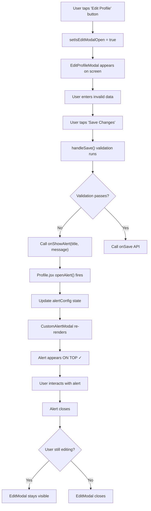

# Modal Architecture - Visual Guide

## Component Tree Structure (FIXED)

```
App
└── Profile Screen
    ├── SafeAreaView (container)
    │   ├── Header
    │   │   ├── Logo
    │   │   └── Menu Button
    │   │
    │   ├── ScrollView (content)
    │   │   ├── Profile Card
    │   │   ├── Tabs Section
    │   │   └── Tab Content
    │   │
    │   ├── EditProfileModal ← First Modal
    │   │   └── Modal (transparent slide animation)
    │   │       └── Form Content + Buttons
    │   │           (Can trigger alerts via onShowAlert prop)
    │   │
    │   ├── CustomAlertModal ← Second Modal (RENDERED LAST = TOP)
    │   │   └── Modal (transparent fade animation)
    │   │       └── Alert Box with Buttons
    │   │
    │   └── HamburgerMenu
    │       └── Modal overlay with menu items
    │
    └── Others...
```

---

## Rendering Order & Z-Index Flow

### BEFORE (BROKEN ❌):
```
React Native Portal Stack:
┌─────────────────────────┐
│  HamburgerMenu          │ ← Top
├─────────────────────────┤
│  EditProfileModal       │ ← Rendered AFTER = On top (WRONG!)
├─────────────────────────┤
│  CustomAlertModal       │ ← Rendered FIRST = Behind (BUG!)
├─────────────────────────┤
│  Main Content (scroll)  │
└─────────────────────────┘

Problem: Alert gets trapped behind EditModal!
```

### AFTER (FIXED ✓):
```
React Native Portal Stack:
┌─────────────────────────┐
│  CustomAlertModal       │ ← Rendered LAST = On top ✓
├─────────────────────────┤
│  EditProfileModal       │ ← Rendered BEFORE = Below ✓
├─────────────────────────┤
│  HamburgerMenu          │
├─────────────────────────┤
│  Main Content (scroll)  │
└─────────────────────────┘

Result: Alert always appears on top!
```

---

## Alert Communication Flow

### Scenario: User triggers alert while editing profile

```
┌──────────────────────────────────────────────────────────────┐
│  1. User interacts with EditProfileModal                     │
│     - Clicks "Save Changes"                                  │
│     - Form validation fails                                  │
└──────────────────────────────────────────────────────────────┘
                            ↓
┌──────────────────────────────────────────────────────────────┐
│  2. EditProfileModal calls onShowAlert() prop                │
│     onShowAlert('Error', 'Phone number invalid')             │
└──────────────────────────────────────────────────────────────┘
                            ↓
┌──────────────────────────────────────────────────────────────┐
│  3. Profile Screen's openAlert() function is invoked         │
│     Updates localstate:                                      │
│     setAlertConfig({                                         │
│       visible: true,                                         │
│       title: 'Error',                                        │
│       message: 'Phone number invalid'                        │
│     })                                                       │
└──────────────────────────────────────────────────────────────┘
                            ↓
┌──────────────────────────────────────────────────────────────┐
│  4. CustomAlertModal re-renders with new props               │
│     visible={true}                                           │
│     title="Error"                                            │
│     message="Phone number invalid"                           │
└──────────────────────────────────────────────────────────────┘
                            ↓
┌──────────────────────────────────────────────────────────────┐
│  5. Alert appears ON TOP of EditProfileModal ✓               │
│     ┌─────────────────────────────┐                          │
│     │  Error                  ✕   │  ← Alert Modal (ON TOP)  │
│     │                             │                          │
│     │  Phone number invalid       │                          │
│     │                             │                          │
│     │              [OK]           │                          │
│     └─────────────────────────────┘                          │
│                    (Edit form dimmed beneath)                │
└──────────────────────────────────────────────────────────────┘
```

---

## Component Props Flow

### Profile.jsx → EditProfileModal

```javascript
<EditProfileModal
  visible={isEditModalOpen}              // Control modal visibility
  onClose={() => setIsEditModalOpen(false)}  // Close handler
  customerData={customerData}            // User data to display
  onSave={handleSaveProfile}             // Save callback
  isLoading={isEditLoading}              // Loading state
  onShowAlert={openAlert}                // ← NEW: Alert function prop
/>
```

### Profile.jsx → CustomAlertModal

```javascript
<CustomAlertModal
  visible={alertConfig.visible}          // Show/hide
  title={alertConfig.title}              // Alert title
  message={alertConfig.message}          // Alert message
  mode={alertConfig.mode}                // 'alert' or 'confirm'
  onConfirm={alertConfig.onConfirm}      // OK/Confirm callback
  onCancel={alertConfig.onCancel}        // Cancel callback (confirm mode)
  onClose={closeAlert}                   // Close callback
/>
```

### EditProfileModal Alert Call

```javascript
// When error occurs:
if (typeof onShowAlert === 'function') {
  onShowAlert(
    'Error',                          // title
    'Password is incorrect',           // message
    () => { /* optional callback */ }  // onConfirm callback
  );
}

// This calls Profile.jsx's openAlert() function with these params
```

---

## Modal Layering Rules (Important!)

### Rule 1: Render Order Determines Z-Index
```jsx
{/* Earlier in JSX = Lower in stack */}
<Modal>Lower</Modal>        // Renders first
<Modal>Higher</Modal>       // Renders last = On top ✓
```

### Rule 2: React Native Portal Stacking
All Modals are rendered to a native modal stack, NOT the DOM. The last Modal added to this stack appears on top.

### Rule 3: Never Nest Modals
```jsx
// ❌ BAD - Nested modals cause layering issues
<Modal visible={editVisible}>
  {/* Form content */}
  <Modal visible={alertVisible}>  {/* Alert inside modal! */}
    {/* Alert content */}
  </Modal>
</Modal>

// ✓ GOOD - Sibling modals
<Modal visible={editVisible}>
  {/* Form content */}
</Modal>
<Modal visible={alertVisible}>
  {/* Alert content */}
</Modal>
```

### Rule 4: Render Alert Modal Last
```jsx
   return (
  <SafeAreaView>
    {/* Main content */}
    
    <Modal1 />  {/* First */}
    <Modal2 />  {/* Second */}
    <AlertModal />  {/* LAST = ON TOP ✓ */}
  </SafeAreaView>
);
```

---

## Event Flow Diagram



---

## Screen State Examples

### State 1: Profile Screen - Normal State
```
┌────────────────────────────────────┐
│  Profile Screen                    │
│                                    │
│  [My Profile]                      │
│  ┌──────────────────────────────┐ │
│  │ Sarah Johnson                │ │
│  │ sarah@email.com              │ │
│  │ Member since: January 2025   │ │
│  │          [Sign Out]          │ │
│  └──────────────────────────────┘ │
│                                    │
│  [Profile Info] [Measurements]... │
│  Content here...                   │
│                                    │
└────────────────────────────────────┘
```

### State 2: EditProfileModal Open
```
┌────────────────────────────────────┐
│  Profile Screen (dimmed background)│
│                                    │
│  ┌──────────────────────────────┐ │
│  │ Edit Profile          ✕      │ │
│  │                              │ │
│  │ First Name:                  │ │
│  │ [Sarah                    ]  │ │
│  │                              │ │
│  │ Email:                       │ │
│  │ [sarah@email.com         ]  │ │
│  │                              │ │
│  │  [Cancel]      [Save Changes]│ │
│  └──────────────────────────────┘ │
│   (EditProfileModal renders here)  │
│                                    │
└────────────────────────────────────┘
```

### State 3: Alert Over EditModal (FIXED!)
```
┌────────────────────────────────────┐
│  Profile Screen (dimmed)           │
│                                    │
│  ┌──────────────────────────────┐ │
│  │ Edit Profile (dimmed)        │ │  ← Modal still visible but dimmed
│  │                              │ │
│  │ First Name: [invalid]        │ │
│  │                              │ │
│  │        ┌──────────────────┐  │ │
│  │        │ Error       ✕    │  │ │  ← Alert ON TOP!
│  │        │                  │  │ │
│  │        │ Phone invalid    │  │ │
│  │        │                  │  │ │
│  │        │      [OK]        │  │ │
│  │        └──────────────────┘  │ │
│  │                              │ │
│  └──────────────────────────────┘ │
│                                    │
└────────────────────────────────────┘
```

---

## React Native Modal Props Used

### CustomAlertModal Props:
```javascript
<Modal
  visible={alertConfig.visible}        // Controls visibility
  transparent={true}                   // Background is transparent
  animationType="fade"                 // Smooth fade in/out animation
  statusBarTranslucent={true}          // Modal extends behind status bar
  onRequestClose={handleClose}         // Android back button handler
>
  {/* Modal content */}
</Modal>
```

### EditProfileModal Props:
```javascript
<Modal
  visible={visible}                    // Controlled by parent
  animationType="slide"                // Slide up from bottom
  transparent={true}                   // Semi-transparent background
  // No statusBarTranslucent here as form needs full view
>
  {/* Form content */}
</Modal>
```

---

## Key Improvements Summary

| Aspect | Before | After |
|--------|--------|-------|
| **Modal Order** | Alert rendered first | Alert rendered last |
| **Nesting** | Alert nested inside EditModal | Alerts as siblings |
| **State Management** | Alert state in EditModal | Alert state in Profile |
| **Communication** | Direct state management | Prop-based function calls |
| **Z-Index Issues** | Alert behind form | Alert on top ✓ |
| **Code Duplication** | Alert logic duplicated | Single alert manager |
| **Maintainability** | Harder to debug | Clear parent-child flow |

---

## Architecture Benefits

🎯 **Single Responsibility** - Each component has one job  
🎯 **Prop Drilling** - Clear data flow via props  
🎯 **Predictable** - Modal order always produces correct z-index  
🎯 **Scalable** - Easy to add more components needing alerts  
🎯 **Testable** - Each component can test independently  
🎯 **Performance** - No unnecessary re-renders or state conflicts  

This is the recommended pattern for React Native modal management! ✨
